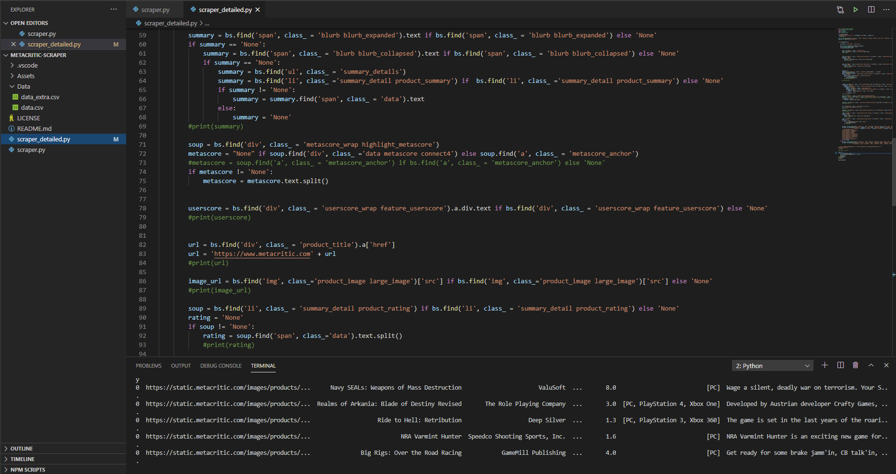

# METACRITIC SCRAPER
I've been looking forward to work on Data Science projects based on Video Game datasets but wasn't satisfied with them. So, I decided to take a crack at it on my own. It's not perfect but it's something. I'll be adding more features from time to time.


### How-To :
Running **scraper_detailed.py** after **scraper. py** Script should work as is. But in case there is an exception or error. You can simply change the starting point of the script again ...

```sh
# scraper_detailed.py 
count = 0    <- Starting point of your scrape loop.
for i in base_df['URL'][0:]: <-- replace the '0' with same number as count.
    df = df.append(scrappy(base_url = str(i)))
    count+=1
    print(count)
```
I'm trying to mitigate all possible errors that could surface, since certain games have a very different HTML composition.
